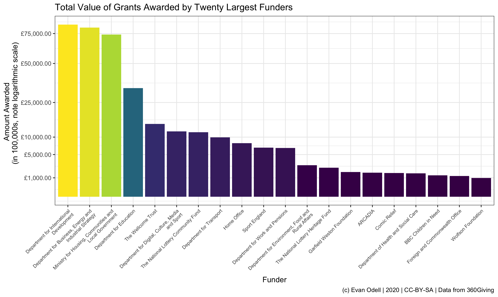

<!-- README.md is generated from README.Rmd. Please edit that file -->

<!-- badges: start -->

[](https://www.gnu.org/licenses/gpl-3.0)
[](https://cran.r-project.org/package=threesixtygiving)
[](https://github.com/evanodell/threesixtygiving)
[](https://dgrtwo.shinyapps.io/cranview/)
[](https://travis-ci.org/evanodell/threesixtygiving)
[](https://codecov.io/gh/evanodell/threesixtygiving?branch=master)
[](https://ci.appveyor.com/project/evanodell/threesixtygiving)
[](https://zenodo.org/badge/latestdoi/195080045)
<!-- badges: end -->

# threesixtygiving

Access open data from [360Giving](https://www.threesixtygiving.org/)
publishers. 360Giving is a data standard for publishing information
about charitable grant giving in the UK. 360Giving maintains a [registry
of grant makers](http://data.threesixtygiving.org/) using the standard.
The package provides functions to search and retrieve data on charitable
giving.

## Installation

<!--
You can install the released version of threesixtygiving from [CRAN](https://CRAN.R-project.org) with:
``` r
install.packages("threesixtygiving")
```
-->

You can install the development version from
[GitHub](https://github.com/evanodell/threesixtygiving) with:

``` r
# install.packages("devtools")
devtools::install_github("evanodell/threesixtygiving")
```

## Purpose

The `threesixtygiving` package provides tools for programmatically
downloading and analysing grants made by charitable trusts using the
[360Giving standard](https://standard.threesixtygiving.org/). These
include functions to search available datasets, retrieve data and
process it to tidy formats.

## Usage

``` r
library(threesixtygiving)
library(dplyr)
library(ggplot2)

grants <- tsg_all_grants(timeout = 8, retries = 1)

df <- tsg_core_data(grants)

df2 <- df %>% 
  mutate(amount_awarded = case_when(
    currency == "USD" ~ amount_awarded/1.29, ## rate on 2019-10-24
    currency == "CAD" ~ amount_awarded/1.70, 
    currency == "CHF" ~ amount_awarded/1.27, 
    currency == "EUR" ~ amount_awarded/1.17,
    TRUE ~ amount_awarded)) %>%
  group_by(funding_org_name) %>%
  summarise(n = n(),
            amount_awarded = sum(amount_awarded)) %>%
  mutate(avg = amount_awarded/n)

theme_set(theme_bw())

p1 <- ggplot(df2 %>% top_n(20, amount_awarded) %>% 
               mutate(amount_awarded2 = amount_awarded/100000),
             aes(x = reorder(funding_org_name, -amount_awarded2),
                 y = amount_awarded2, fill = amount_awarded2)) + 
  geom_col() + 
  scale_y_sqrt(labels = scales::dollar_format(prefix = "£"),
               breaks = c(1000, 5000, 10000, 25000, 50000, 75000, 100000)) + 
  scale_x_discrete(labels = scales::wrap_format(30)) + 
  scale_fill_viridis_c() + 
  labs(x = "Funder", y = "Amount Awarded 
       (in 100,000s, note logarithmic scale)",
       title = "Total Value of Grants Awarded by Twenty Largest Funders",
       caption = "(c) Evan Odell | Disability Rights UK | 2020 | CC-BY-SA
       Data from 360Giving") + 
  theme(axis.text.x = element_text(angle = 45, hjust = 1, size = 8),
        legend.position = "none") 
  
p1
```



## Notes

This project is possible thanks to support and encouragement from David
Kane at [360Giving](http://www.threesixtygiving.org/), and from
[Disability Rights UK](https://www.disabilityrightsuk.org/).

### Data licences

The actual grant data is available under a variety of open licences,
typically a version of the Open Government Licence or one of the
Creative Commons licences. Please respect the licence conditions that
are attached to each dataset.

### Citing `threesixtygiving`

Please cite `threesixtygiving` as:

Odell, Evan (2019). *threesixtygiving: Download Charitable Grants from
the ‘360Giving’ Platform*. doi:
[10.5281/zenodo.3474128](https://doi.org/10.5281/zenodo.3474128), R
package version 0.1.1.9000, URL:
<https://docs.evanodell.com/threesixtygiving>

A BibTeX entry for LaTeX users is:

``` 
  @Manual{,
    title = {threesixtygiving: Download Charitable Grants from the '360Giving' Platform},
    author = {Evan Odell},
    year = {2019},
    doi = {10.5281/zenodo.3474128},
    url = {https://docs.evanodell.com/threesixtygiving},
    note = {R package version 0.1.1.9000},
  }
```

### Code of Conduct

Please note that the `threesixtygiving` package is released with a
[Contributor Code of
Conduct](https://github.com/evanodell/threesixtygiving/blob/master/CODE_OF_CONDUCT.md).
By contributing to this project, you agree to abide by its terms.
