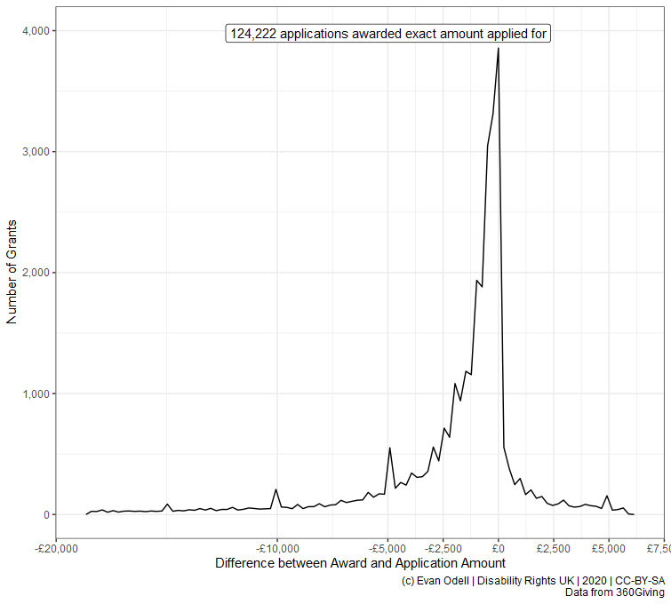
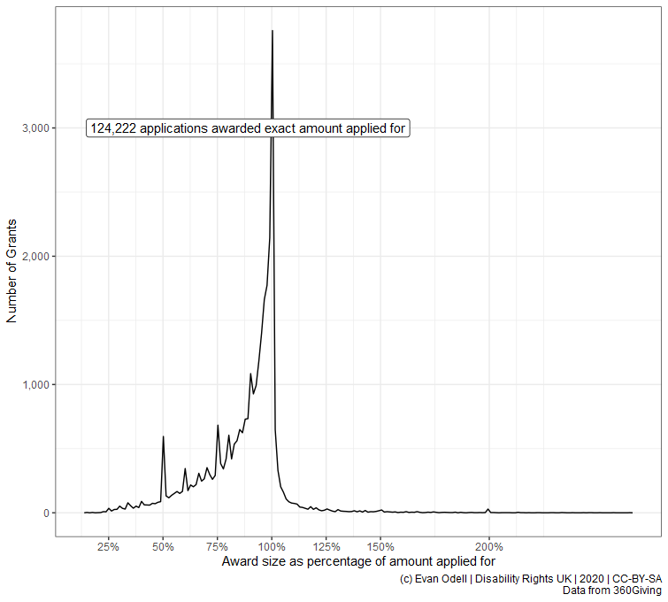

```{r setup, include = FALSE}
knitr::opts_chunk$set(
  collapse = TRUE,
  comment = "#>",
  message = FALSE
)
```

This package provides tools to access and process data from [360Giving](https://www.threesixtygiving.org/), a data standard for publishing information about charitable grant giving in the UK. The ability to search for and query different data is similar to the [GrantNav](https://grantnav.threesixtygiving.org/) tool created by 360Giving. There are several advantages to using the software package instead of GrantNav:

1. It lets you retrieve 360Giving data, search and summarise that data, create charts and tables entirely within R.

2. It gives you access to the raw data provided by funders. The 360Giving standard allows for optional information that is not provided by most funders or included in GrantNav. This information can be useful to fundraising managers in some situations, as well as to researchers wanting to understand the size, scope and approaches to charitable trust giving in the UK. 

3. `threesixtygiving` returns data in types and structures designed for R.

The example below shows the average size of grants given by various funders:

```{r grouping-example, eval=FALSE}
library(threesixtygiving)
library(dplyr) ## A package used to manipulate and process data

# Download all the grant data available.
# It comes out in a list of tibbles but that's not a problem:
grants <- tsg_all_grants(timeout = 10, retries = 0) 

# Get just the core data required by the 360Giving standard.
# Convert that list of tibbles into a tidy format:
all_data <- tsg_core_data(grants) 

avg_size <- all_data %>% #This %>% thing is a called a pipe. Pipes are love. Pipes are life.
  filter(currency == "GBP") %>% # Filter out non-£ data
  group_by(funding_org_name) %>% # Group all the funders together
  summarise(avg = mean(amount_awarded)) # Get the average of given value for each group, kinda like =AVERAGEIFS in Excel.

avg_size

# # A tibble: 109 x 2
#    funding_org_name                             avg
#    <chr>                                      <dbl>
#  1 A B Charitable Trust                      13714.
#  2 Barrow Cadbury Trust                      35889.
#  3 BBC Children in Need                      55968.
#  4 Birmingham City Council                   32097.
#  5 Calouste Gulbenkian Foundation, UK Branch 34352.
#  6 Camden Giving                             18254.
#  7 Cheshire Community Foundation              6027.
#  8 City Bridge Trust                         81381.
#  9 Cloudesley                                14441.
# 10 Co-operative Group                         3238.
# # ... with 99 more rows

```


The `tsg_all_grants()` function retrieves all the grant data. And if data isn't available, or there is a downloading error, it will print a message warning you. No more silently failing downloads. There is even a `tsg_missing()` function, which will take the output of `tsg_all_grants()` and tell you what's missing.

Say you want to include all the grants that are in currencies other than pounds, but convert their value to pounds? In the example below I show a way to do that where I just looked up the currency conversion rates on my phone and changed the currency based on that, but you could also write some code that takes the currency code, the award date, and passes them to the https://fixer.io currency conversion service using the [`fixerapi`](https://cran.r-project.org/package=fixerapi) package, which provided you have the right account type, will convert the currency value to pound using the conversion rate on the day the grant was awarded.


## Retrieve all grants

Below are all the R packages that I'm using create the graphs and such in this article.

```{r packages, eval=FALSE}
library(threesixtygiving)
library(ggrepel)
library(readr)
library(purrr)
library(dplyr)
library(stringr)
library(ggplot2)
```

First, I'm going to retrieve all the grant data. The `timeout = 8` means I'm having the function give up trying to retrieve data after 8 seconds for each file, and `retries = 1` means it is only going to retry failed retrievals once, then it will give up and move on to retrieve the next data set.

```{r retrieve-grants, eval=FALSE}
grants <- tsg_all_grants(timeout = 8, retries = 1)
```

```{r save-grants, eval=FALSE, include=FALSE}
library(readr)

write_rds(grants, "grants.rds")

```


```{r read-in-grant-rds, include=FALSE, eval=FALSE}
grants <- read_rds("grants.rds")
```

Because of my minimal timeout and retries, as well as possible other problems with how organisations configure their servers, there are some datasets missing: 

```{r missing-data, eval=FALSE}
tsg_missing(grants)

# # A tibble: 7 x 14
#   title description identifier license license_name issued modified download_url access_url data_type
#   <chr> <chr>       <chr>      <chr>   <chr>        <chr>  <chr>    <chr>        <chr>      <chr>    
# 1 Gran~ ""          a001p0000~ https:~ Creative Co~ 2019-~ 2019-11~ https://jof~ https://j~ xlsx     
# 2 Gran~ ""          a00240000~ https:~ Creative Co~ 2017-~ 2018-08~ https://pea~ https://p~ xlsx     
# 3 Gran~ ""          a00240000~ https:~ Creative Co~ 2017-~ 2018-08~ https://pea~ https://p~ xlsx     
# 4 Gran~ ""          a001p0000~ https:~ Creative Co~ 2018-~ 2019-03~ https://pea~ https://p~ xlsx     
# 5 Gran~ ""          a001p0000~ https:~ Creative Co~ 2018-~ 2019-08~ https://tud~ https://t~ xlsx     
# 6 True~ ""          a00240000~ https:~ Creative Co~ 2016-~ 2018-08~ http://ods.~ http://ww~ unknown  
# 7 Wood~ ""          a001p0000~ https:~ Creative Co~ 2017-~ 2018-08~ http://ods.~ http://ww~ unknown  
# # ... with 4 more variables: publisher_name <chr>, publisher_website <chr>, publisher_logo <chr>,
# #   publisher_prefix <chr>

```

However, we know they are missing, and we can retry downloading just them if needed using the `tsg_specific_df()` function. But I'll ignore them for now.

## Core data

`tsg_all_grants` returns a list of tibbles, due to differences in the data provided by each funder. `tsg_core_data` returns a tibble with the 10 columns in the [360Giving Open Standard](https://standard.threesixtygiving.org/en/latest/#), plus the publisher prefix used to identify each funder. `tsg_process_data()` converts a list of tibbles into a single tibble, preserving all columns (with an option to only preserve columns where a minimum proportion have data). In the case below I have converted non-GBP currencies to GBP on the rates on 2020-01-17.


```{r core-data, eval=FALSE}
df <- tsg_core_data(grants)

df2 <- df %>% 
  mutate(amount_awarded = case_when(
    currency == "USD" ~ amount_awarded/1.3044, ## rate on 2020-01-17
    currency == "CAD" ~ amount_awarded/1.7017, 
    currency == "CHF" ~ amount_awarded/1.2630, 
    currency == "EUR" ~ amount_awarded/1.1750,
    TRUE ~ amount_awarded)) %>%
  group_by(funding_org_name) %>%
  summarise(n = n(),
            amount_awarded = sum(amount_awarded)) %>%
  mutate(avg = amount_awarded/n)
```


## Processing data 

```{r award-differences, eval=FALSE}
proc_df <- tsg_process_data(grants) 

proc_amount_df <- proc_df  %>% 
  select(identifier, title, description, funding_org_name,
         amount_awarded, amount_applied_for) %>%
  mutate_at(.vars = vars(amount_awarded, amount_applied_for), as.numeric) %>% 
  mutate(difference = amount_awarded-amount_applied_for,
         percentage_of = amount_awarded/amount_applied_for) %>% 
  filter(!is.na(amount_applied_for), amount_applied_for > 2500,
         amount_awarded > 2500,
         percent_rank(difference) >= 0.02 &
           percent_rank(difference) <= 0.98) %>% ## remove outliers
  mutate(difference = round(difference))

count0 <- proc_amount_df %>%
  filter(difference==0) %>%
  tally()
  
p4 <- ggplot(proc_amount_df %>% filter(difference != 0),
             aes(x = difference)) + 
  geom_freqpoly(bins = 100) + 
  geom_label_repel(
    aes(x = 0, y = 4000,
        label = paste0(scales::comma(n),
                       " applications awarded exact amount applied for")),
    data = count0) + 
  scale_color_viridis_c() + 
  scale_y_continuous(labels = scales::comma) + 
  scale_x_continuous(labels = scales::dollar_format(prefix = "£"),
                     breaks = c(-20000, -10000, -5000, -2500,
                                0, 2500, 5000, 7500)) + 
  labs(x = "Difference between Award and Application Amount",
       y = "Number of Grants",
       caption = "(c) Evan Odell | Disability Rights UK | 2020 | CC-BY-SA
       Data from 360Giving")

p4
```

```{r award-differences-save, eval=FALSE, include=FALSE}
ggsave("vignettes/grant-diff-value.png", p4, type = "cairo",
       width = 20, height = 18, units = "cm", dpi = 96)
```




```{r percentage-awarded, eval=FALSE}
p5 <- ggplot(proc_amount_df %>%
               filter(difference != 0, percentage_of != Inf),
             aes(x = percentage_of)) + 
  geom_freqpoly(bins = 200) + 
  geom_label_repel(
    aes(x = 1, y = 3000, hjust = 1,
        label = paste0(scales::comma(n),
                       " applications awarded exact amount applied for")),
    data = count0) + 
  scale_color_viridis_c() + 
  scale_y_continuous(labels = scales::comma) + 
  scale_x_continuous(labels = scales::percent,
                     breaks = c(0, 0.25, 0.5, 0.75, 1, 1.25, 1.5, 2)) + 
  labs(x = "Award size as percentage of amount applied for",
       y = "Number of Grants",
       caption = "(c) Evan Odell | Disability Rights UK | 2020 | CC-BY-SA
       Data from 360Giving")

p5
```

```{r percentage-awardeds-save, eval=FALSE, include=FALSE}
ggsave("vignettes/grant-diff-perc.png", p5, type = "cairo",
       width = 20, height = 18, units = "cm", dpi = 96)
```




