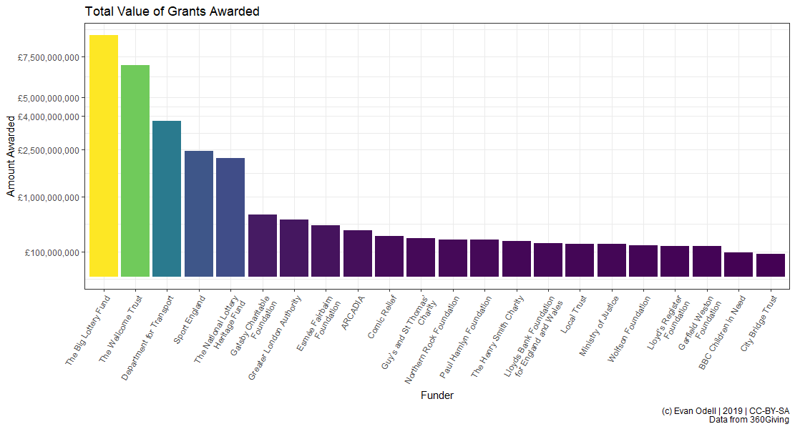
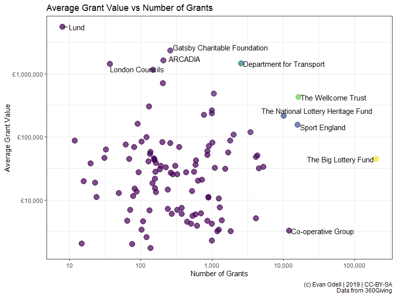
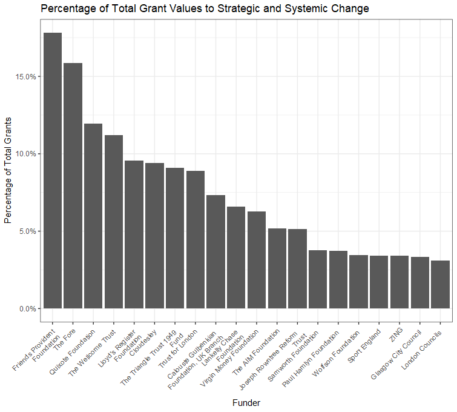

```{r setup, include = FALSE}
knitr::opts_chunk$set(
  collapse = TRUE,
  comment = "#>",
  message = FALSE
)
```


This article describes a software package for the 360Giving platform, written in the [R programming language](https://cran.r-project.org/). R is particularly good for statistics and data visualisation, and is widely used by journalists, academics and data analysts. I have created [quite a few R packages ](https://docs.evanodell.com) that retrieve data from all kinds of sources, with similar aims to `threesixtygiving`.

I've created this package to access data from 360Giving, a data standard for publishing information about charitable grant giving in the UK. The ability to search for and query different data is similar to the [GrantNav](https://grantnav.threesixtygiving.org/) tool created by 360Giving. There are several advantages to using the software package instead of GrantNav:

1. It lets you retrieve 360Giving data, search and summarise that data, create charts and tables and write text using a single file. This is very useful for nerds like me -- this entire article comes from a single computer file that contains both this text and the computer code used to generate all the graphs. 

2. It gives you access to the raw data provided by funders. The 360Giving standard allows for optional information that is not provided by most funders or included in GrantNav. This information can be useful to fundraising managers in some situations, as well as to researchers wanting to understand the size, scope and approaches to charitable trust giving in the UK. 

3. `threesixtygiving` returns data in types and structures designed for R. I've done the work of mucking around with file organising and processing to ensure consistency across various file sources, such as ensuring that the dozens of possible date formats are converted to the R `Date` class.

The big disadvantage is that the `threesixtygiving` package is mucher harder to use than GrantNav is. For a lot of people and use-cases `threesixtygiving` is overkill. If you're not familiar with R and data analysis isn't a big part of your job, you probably don't need this package. But let me evangelise R for a bit.

Say you want to know the average grant size given by each of the funders in GrantNav, and you've downloaded the CSV file with all their data from GrantNav (and the CSV file download completely and saved, because sometimes the internet cuts out and you lose a bunch of rows without warning and the file still opens, and it isn't until you're presenting your results to SMT that for some reason you have no data on what the Big Lottery has funded). Here are your steps:

1. Create a new worksheet.

1. Locate the "Funding Org:Name" column.

3. Copy and paste "Funding Org:Name" column into the new worksheet.

4. Highlight the entire column, then click the "Remove Duplicates" button.

5. Type the name of the `=AVERAGEIF` formula in the column next to your column of removed duplicate funding org names. 

5. Click into your old worksheet, select the "Amount Awarded" column.

6. Realise that `=AVERAGEIF` and `=AVERAGEIFs` want data in a different order. Press escape. Click back to your new worksheet. Change `=AVERAGEIF` to `=AVERAGEIFs`.

7. Select the "Amount Awarded" column, than the "Funding Org:Name", then click back to you new work sheet and select the single cell in your column of removed duplicate funding org names.

8. Double click to fill the column. Realise you have a bunch of errors because you forgot to press F4 or put dollar signs into the first two ranges in your formula. 

9. Realise that a bunch of grants are in a currency other than pounds. Waste 10 minutes weighing the pros and cons of deleting them, then realise that you have no easy way to convert those currencies to pounds. Delete those rows, hope you haven't accidentally lost anything you wanted.

10. Your boss asks for average grant value per year. Realise that roughly 89% of dates have time zone information encoded and Excel couldn't figure out how to process it. Realise that this is probably the first time in history that Excel has made someone's life difficult by [_not_ assuming everything is a date](https://genomebiology.biomedcentral.com/articles/10.1186/s13059-016-1044-7).

11. Take a break. Have a cup of tea. Wonder vaguely if stuff like this is the reason the UK struggles with low productivity-per-hour. Feel a twinge of envy of hunter-gatherer societies. 

Now, here's how you do it in R. The bits with "#"'s in front of them are comments, they are little notes you can write to yourself so you remember what you did, or so someone else can read your code and know what you're doing. 

```{r grouping-example, eval=FALSE}
library(threesixtygiving)
library(dpyr) ## A package used to manipulate and process data

# Download all the grant data available.
# It comes out in a list of tibbles but that's not a problem:
grant_list <- tsg_all_grants() 

# Get just the core data required by the 360Giving standard.
# Convert that list of tibbles into a tidy format:
all_data <- tsg_core_data(grant_list) 

avg_size <- all_data %>% #This %>% thing is a called a pipe. Pipes are love. Pipes are life.
  filter(currency == "GBP") %>% # Filter out non-£ data
  group_by(funding_org_name) %>% # Group all the funders together
  summarise(avg = mean(amount_awarded)) # Get the average of given value for each group, kinda like =AVERAGEIFS in Excel.

avg_size

# # A tibble: 109 x 2
#    funding_org_name                             avg
#    <chr>                                      <dbl>
#  1 A B Charitable Trust                      13714.
#  2 Barrow Cadbury Trust                      35889.
#  3 BBC Children in Need                      55968.
#  4 Birmingham City Council                   32097.
#  5 Calouste Gulbenkian Foundation, UK Branch 34352.
#  6 Camden Giving                             18254.
#  7 Cheshire Community Foundation              6027.
#  8 City Bridge Trust                         81381.
#  9 Cloudesley                                14441.
# 10 Co-operative Group                         3238.
# # ... with 99 more rows

```


Your boss comes and asks for average per year? Spot the difference:

```{r value-year-example, eval=FALSE}

avg_size_year <- all_data %>%
  filter(currency == "GBP") %>% # Filter out non-£ data
  group_by(funding_org_name, lubridate::year(award_date)) %>%
  summarise(avg = mean(amount_awarded))

avg_size_year

# # A tibble: 599 x 3
# # Groups:   funding_org_name [109]
#    funding_org_name     `lubridate::year(award_date)`    avg
#    <chr>                                        <dbl>  <dbl>
#  1 A B Charitable Trust                          2013  9407.
#  2 A B Charitable Trust                          2014 10008.
#  3 A B Charitable Trust                          2015 10797.
#  4 A B Charitable Trust                          2016 13689.
#  5 A B Charitable Trust                          2017 16110.
#  6 A B Charitable Trust                          2018 15619.
#  7 A B Charitable Trust                          2019 19387.
#  8 Barrow Cadbury Trust                          2012 31920.
#  9 Barrow Cadbury Trust                          2013 34753.
# 10 Barrow Cadbury Trust                          2014 30378.
# # ... with 589 more rows
```


The `tsg_all_grants()` function retrieves all the grant data. And if data isn't available, or there is a downloading error, it will print a message warning you. No more silently failing downloads. There is even a `tsg_missing()` function, which will take the output of `tsg_all_grants()` and tell you what's missing. Brilliant eh? 

Say you want to include all the grants that are in currencies other than pounds, but convert their value to pounds? In the example below I show a way to do that where I just looked up the currency conversion rates on my phone and changed the currency based on that, but you could also write some code that takes the currency code, the award date, and passes them to the https://fixer.io currency conversion service using the [`fixerapi`](https://cran.r-project.org/package=fixerapi) package, which provided you have the right account type, will convert the currency value to pound using the conversion rate on the day the grant was awarded. Pretty cool, if you're into that sort of thing.


## Retrieve all grants

Below are all the R packages that I'm using create the graphs and such in this article.

```{r packages}
library(threesixtygiving)
library(ggrepel)
library(readr)
library(purrr)
library(dplyr)
library(stringr)
library(ggplot2)
```

First, I'm going to retrieve all the grant data. The `timeout = 8` means I'm having the function give up trying to retrieve data after 8 seconds for each file, and `retries = 1` means it is only going to retry failed retrievals once, then it will give up and move on to retrieve the next data set.

```{r retrieve-grants, eval=FALSE}
grants <- tsg_all_grants(timeout = 8, retries = 1)
```

```{r save-grants, eval=FALSE, include=FALSE}
library(readr)

write_rds(grants, "vignettes/grants.rds")

```


```{r read-in-grant-rds, include=FALSE, eval=FALSE}
grants <- read_rds("vignettes/grants.rds")
```

Because of my minimal timeout and retries, as well as possible other problems with how organisations configure their servers, there are some datasets missing: 

```{r missing-data, eval=FALSE}
tsg_missing(grants)

# # A tibble: 7 x 14
#   title description identifier license license_name issued modified download_url access_url data_type
#   <chr> <chr>       <chr>      <chr>   <chr>        <chr>  <chr>    <chr>        <chr>      <chr>    
# 1 Gran~ ""          a001p0000~ https:~ Creative Co~ 2019-~ 2019-11~ https://jof~ https://j~ xlsx     
# 2 Gran~ ""          a00240000~ https:~ Creative Co~ 2017-~ 2018-08~ https://pea~ https://p~ xlsx     
# 3 Gran~ ""          a00240000~ https:~ Creative Co~ 2017-~ 2018-08~ https://pea~ https://p~ xlsx     
# 4 Gran~ ""          a001p0000~ https:~ Creative Co~ 2018-~ 2019-03~ https://pea~ https://p~ xlsx     
# 5 Gran~ ""          a001p0000~ https:~ Creative Co~ 2018-~ 2019-08~ https://tud~ https://t~ xlsx     
# 6 True~ ""          a00240000~ https:~ Creative Co~ 2016-~ 2018-08~ http://ods.~ http://ww~ unknown  
# 7 Wood~ ""          a001p0000~ https:~ Creative Co~ 2017-~ 2018-08~ http://ods.~ http://ww~ unknown  
# # ... with 4 more variables: publisher_name <chr>, publisher_website <chr>, publisher_logo <chr>,
# #   publisher_prefix <chr>

```

However, we know they are missing, and we can retry downloading just them if needed using the `tsg_specific_df()` function. But I'll ignore them for now.


## Core data

`tsg_all_grants` returns a list of tibbles, due to differences in the data provided by each funder. `tsg_core_data` returns a tibble with the 10 columns in the [360Giving Open Standard](https://standard.threesixtygiving.org/en/latest/#), plus the publisher prefix used to identify each funder. In the case below I have converted non-GBP currencies to GBP on the rates on 2019-11-14.


```{r core-data, eval=FALSE}
df <- tsg_core_data(grants)

df2 <- df %>% 
  mutate(amount_awarded = case_when(
    currency == "USD" ~ amount_awarded/1.29, ## rate on 2019-10-24
    currency == "CAD" ~ amount_awarded/1.70, 
    currency == "CHF" ~ amount_awarded/1.27, 
    currency == "EUR" ~ amount_awarded/1.17,
    TRUE ~ amount_awarded)) %>%
  group_by(funding_org_name) %>%
  summarise(n = n(),
            amount_awarded = sum(amount_awarded)) %>%
  mutate(avg = amount_awarded/n)
```


Now I've made a bunch of graphs highlighting what you can do with 

```{r value-of-all-grants, eval=FALSE}
theme_set(theme_bw())

p1 <- ggplot(df2 %>% top_n(20, amount_awarded) %>% 
               mutate(amount_awarded2 = amount_awarded/100000),
             aes(x = reorder(funding_org_name, -amount_awarded2),
                 y = amount_awarded2, fill = amount_awarded2)) + 
  geom_col() + 
  scale_y_sqrt(labels = scales::dollar_format(prefix = "£"),
               breaks = c(1000, 5000, 10000, 25000, 50000, 75000, 100000)) + 
  scale_x_discrete(labels = scales::wrap_format(30)) + 
  scale_fill_viridis_c() + 
  labs(x = "Funder", y = "Amount Awarded 
       (in 100,000s, note logarithmic scale)",
       title = "Total Value of Grants Awarded by Twenty Largest Funders",
       caption = "(c) Evan Odell | Disability Rights UK | 2019 | CC-BY-SA
       Data from 360Giving") + 
  theme(axis.text.x = element_text(angle = 45, hjust = 1, size = 8),
        legend.position = "none") 
  
p1
```

```{r value-of-all-grants-save, eval=FALSE, include=FALSE}
ggsave("vignettes/total-value.png", p1, type = "cairo",
       width = 20, height = 15, units = "cm", dpi = 96)
```




The plot below shows the average grant value from each funder, with the number of reported grants given by each funder.

```{r avg-grant-size, eval=FALSE}
p2 <- ggplot(df2 %>% top_n(20, amount_awarded),
             aes(x = reorder(funding_org_name, -avg),
                 y = avg, fill = avg)) + 
  geom_col() + 
  geom_label_repel(aes(label = scales::comma(n)), nudge_y = 1,
              alpha = 0.35, size = 3.25, hjust =0.5, direction = "y") + 
  scale_y_sqrt(labels = scales::dollar_format(prefix = "£")) + 
  scale_x_discrete(labels = scales::wrap_format(25)) + 
  scale_fill_viridis_c() + 
  labs(x = "Funder", y = "Average Grant Value",
       title = "Average Grant Value",
       subtitle = "Label is the total number of grants awarded",
       caption = "(c) Evan Odell | Disability Rights UK | 2019 | CC-BY-SA
       Data from 360Giving") +
  theme(axis.text.x = element_text(angle = 45, hjust = 1, size = 8),
        legend.position = "none") 

p2
```


```{r avg-grant-size-save, eval=FALSE, include=FALSE}
ggsave("vignettes/avg-grant-value.png", p2, type = "cairo",
       width = 20, height = 15, units = "cm", dpi = 96)
```


```{r size, eval=FALSE}
p3 <- ggplot(df2, aes(x = n, y = avg, colour = amount_awarded)) + 
  geom_point(alpha = 0.7, size = 4) + 
  geom_text_repel(data = bind_rows(df2 %>% top_n(5, avg),
                                   df2 %>% top_n(5, amount_awarded),
                                   df2 %>% top_n(5, n),
                                   df2 %>% top_n(5, -n),
                                   df2 %>% top_n(5, -amount_awarded)) %>% 
                    distinct(),
                  mapping = aes(label = funding_org_name), colour = "black",
                  direction = "both",
                  arrow = arrow(length = unit(0.03, "npc"), type = "open", ends = "last")) + 
  scale_colour_viridis_c() + 
  scale_y_log10(labels = scales::dollar_format(prefix = "£")) + 
  scale_x_log10(labels = scales::comma) + 
  labs(y = "Average Grant Value", x = "Number of Grants",
       title = "Average Grant Value vs Number of Grants",
       caption = "(c) Evan Odell | Disability Rights UK | 2019 | CC-BY-SA
       Data from 360Giving") +
  theme(legend.position = "none") 

p3
```

```{r size-save, eval=FALSE, include=FALSE}
ggsave("vignettes/grant-size-n.png", p3, type = "cairo",
       width = 20, height = 18, units = "cm", dpi = 96)
```


In the the plot below I've highlighted funders that make very many or very few grants, and that are either very large or very small.




### Award sizes

In the two examples below, we can see differences between the amount of money applied for and the amount awarded. Not every funder reports the amount applied for, and some report what seem like placeholder values, such as grant programmes where applicants do not need to specify the value of the grant, only what they want to do and leave the award amount up to the funder. 

```{r award-differences, eval=FALSE}
proc_df <- tsg_process_data(grants) 

proc_amount_df <- proc_df  %>% 
  select(identifier, title, description, funding_org_name,
         amount_awarded, amount_applied_for) %>%
  mutate_at(.vars = vars(amount_awarded, amount_applied_for), as.numeric) %>% 
  mutate(difference = amount_awarded-amount_applied_for,
         percentage_of = amount_awarded/amount_applied_for) %>% 
  filter(!is.na(amount_applied_for), amount_applied_for > 2500,
         amount_awarded > 2500,
         percent_rank(difference) >= 0.02 &
           percent_rank(difference) <= 0.98) %>% ## remove outliers
  mutate(difference = round(difference))

count0 <- proc_amount_df %>%
  filter(difference==0) %>%
  tally()
  
p4 <- ggplot(proc_amount_df %>% filter(difference != 0),
             aes(x = difference)) + 
  geom_freqpoly(bins = 100) + 
  geom_label_repel(
    aes(x = 0, y = 4000,
        label = paste0(scales::comma(n),
                       " applications awarded exact amount applied for")),
    data = count0) + 
  scale_color_viridis_c() + 
  scale_y_continuous(labels = scales::comma) + 
  scale_x_continuous(labels = scales::dollar_format(prefix = "£"),
                     breaks = c(-20000, -10000, -5000, -2500,
                                0, 2500, 5000, 7500)) + 
  labs(x = "Difference between Award and Application Amount",
       y = "Number of Grants",
       caption = "(c) Evan Odell | Disability Rights UK | 2019 | CC-BY-SA
       Data from 360Giving")

p4
```

```{r award-differences-save, eval=FALSE, include=FALSE}

ggsave("vignettes/grant-diff-value.png", p4, type = "cairo",
       width = 20, height = 18, units = "cm", dpi = 96)
```


```{r percentage-awarded, eval=FALSE}
p5 <- ggplot(proc_amount_df %>%
               filter(difference != 0, percentage_of != Inf),
             aes(x = percentage_of)) + 
  geom_freqpoly(bins = 200) + 
  geom_label_repel(
    aes(x = 1, y = 3000, hjust = 1,
        label = paste0(scales::comma(n),
                       " applications awarded exact amount applied for")),
    data = count0) + 
  scale_color_viridis_c() + 
  scale_y_continuous(labels = scales::comma) + 
  scale_x_continuous(labels = scales::percent,
                     breaks = c(0, 0.25, 0.5, 0.75,0.9, 1, 1.25, 1.5, 2)) + 
  labs(x = "Award size as percentage of amount applied for",
       y = "Number of Grants",
       caption = "(c) Evan Odell | Disability Rights UK | 2019 | CC-BY-SA
       Data from 360Giving")

p5
```

```{r percentage-awardeds-save, eval=FALSE, include=FALSE}

ggsave("vignettes/grant-diff-perc.png", p4, type = "cairo",
       width = 20, height = 18, units = "cm", dpi = 96)
```


### Systemic change funders


Organisations that are focused on systemic change and policy-influencing seem to be particularly reliant on trusts and foundations for income. This may be because charitable trusts, particularly large, professionalised funders, have different criteria than members of the public donating money. The most popular type of charity for public donations is animal welfare, according to the [Charities Aid Foundation](https://www.cafonline.org/docs/default-source/about-us-publications/caf-uk-giving-2019-report-an-overview-of-charitable-giving-in-the-uk.pdf?sfvrsn=c4a29a40_4), likely because of the emotional connection many people feel with animals.

The code below is going to get a little bit more complicated, it includes some very basic functional programming and regular expressions. If you don't know what functional programming is, it's basically a way of turning everything into a mathematical formula. If you don't know what regular expressions are, count yourself lucky.


```{r process-data, eval=FALSE}
proc_df <- tsg_process_data(grants)

animal_df <- proc_df %>%
  filter_at(.vars = vars(description, title, contains("primary"),
                         contains("impact"), contains("category"),
                         contains("classificat")),
            .vars_predicate = any_vars(
              str_detect(., regex('animal', 
                                  ignore_case=TRUE))
              ))

strat_df <- proc_df %>%
  filter_at(.vars = vars(description, title, contains("primary"),
                         contains("impact"), contains("category"),
                         contains("classificat")),
            .vars_predicate = any_vars(
              str_detect(., regex('strategy|strategic|systemic', 
                                  ignore_case=TRUE))
              )) 
```


For example, there are 1673 donations to animal-related organisations from 23 trusts in this dataset, compared to 2897 strategic and system change grants from 75 funders. However there do not appear to be any funders focused on strategic funding and systemic change. The plot below shows the twenty funders that have allocated the greatest percentages of their overall funding to what I've deemed strategic issues.

```{r strategic-plot, eval=FALSE}
proc_df <- proc_df %>%
  mutate(
    strategic = str_detect(description, regex('strategy|strategic|systemic', 
                                  ignore_case=TRUE)
              )
  )

proc_df2 <- proc_df %>% 
  group_by(funding_org_name, strategic) %>% 
  summarise(total = sum(amount_awarded),
            mean = mean(amount_awarded),
            median= median(amount_awarded),
            n= n()) %>%
  group_by(funding_org_name) %>%
  mutate(perc_strat = total/sum(total)) %>% 
  ungroup()

twenty_strats <- proc_df2 %>% filter(strategic==TRUE) %>% top_n(20, perc_strat)

p6 <- ggplot(data = twenty_strats,
             aes(x = reorder(funding_org_name, -perc_strat), y = perc_strat,
                 fill = perc_strat)) + 
  geom_col(position = "dodge") + 
  scale_y_continuous(labels = scales::percent) + 
  scale_x_discrete(labels = scales::wrap_format(25)) + 
  scale_fill_viridis_c() + 
  theme(axis.text.x = element_text(angle = 45, hjust=1),
        legend.position = "none") + 
  labs(x = "Funder", y ="Percentage of Total Grants",
       title = "Percentage of Total Grant Values to Strategic and Systemic Change",
       caption = "(c) Evan Odell | Disability Rights UK | 2019 | CC-BY-SA
       Data from 360Giving")

p6
```


```{r strategic-plot-save, eval=FALSE, include=FALSE}
ggsave("vignettes/strategic-funders.png", p6, type = "cairo",
       width = 20, height = 18, units = "cm", dpi = 96)
```





